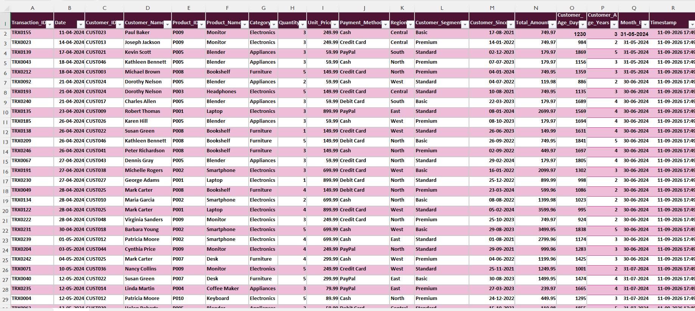
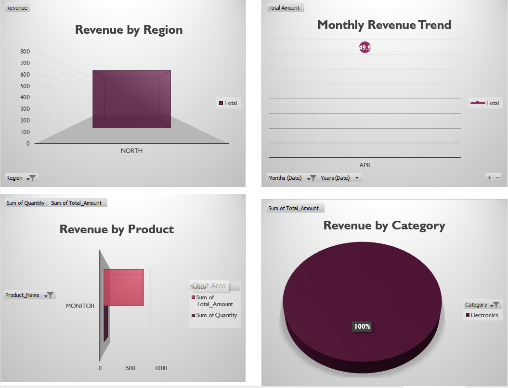
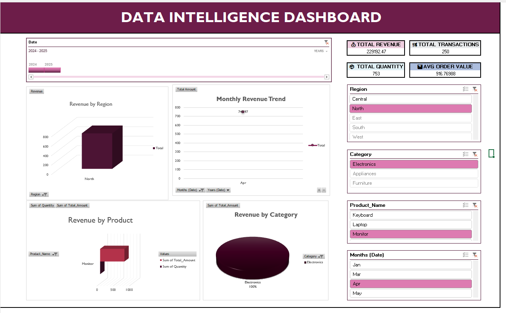

<div align="center">

# -- ! Data Intelligence Dashboard — Excel Analytics Project ! --
### *End-to-End Sales & Customer Analytics using Microsoft Excel*

[](https://www.microsoft.com/excel)
[](https://support.microsoft.com/excel)
[](https://support.microsoft.com/excel)
[](https://support.microsoft.com/excel)

<br/>

> *"Data becomes insight only when it is visualized — a dashboard turns numbers into decisions."*

</div>

---

## 📋 Table of Contents

- [📌 Overview](#-overview)
- [🎯 Problem Statement](#-problem-statement)
- [✨ Key Features](#-key-features)
- [🏗️ Project Structure](#️-project-structure)
- [🔄 Project Workflow](#-project-workflow)
- [📊 Part A — Raw Data & Data Analysis](#-part-a--raw-data--data-analysis)
- [👥 Part B — Customer Value Analysis](#-part-b--customer-value-analysis)
- [🔮 Part C — Scenario Summary & What-If Analysis](#-part-c--scenario-summary--what-if-analysis)
- [📈 Part D — Pivot Analysis & Dashboard](#-part-d--pivot-analysis--dashboard)
- [🖼️ Screenshots](#️-screenshots)
- [🛠️ Tech Stack](#️-tech-stack)
- [📈 Results & Insights](#-results--insights)
- [🏆 Advantages](#-advantages)
- [📄 License](#-license)
- [👤 Author](#-author)
- [🙏 Acknowledgements](#-acknowledgements)

---

## 📌 Overview

The **Data Intelligence Dashboard** is a complete Excel-based analytics project built on a sales transaction dataset. It walks through the full analytics pipeline — from **raw data**, to **KPI analysis**, **customer segmentation**, **scenario/what-if modeling**, and finally a **fully interactive dashboard** with slicers, KPI cards, and dynamic charts.

This project is designed to:
- Organize and structure raw transactional data for analysis
- Compute key business metrics (Revenue, Quantity, Average Order Value)
- Segment and rank customers by value and loyalty
- Model best-case / worst-case business scenarios with Scenario Manager
- Forecast revenue using What-If parameter analysis
- Summarize everything through PivotTables and PivotCharts
- Present findings in one clean, filterable, executive-ready dashboard

---

## 🎯 Problem Statement

> **Objective:** Turn raw multi-column sales transaction data into an interactive business intelligence dashboard.

You are given a raw dataset of **250 sales transactions** spanning multiple regions, products, and customer segments. The task is to clean, analyze, and visualize this data so that a decision-maker can instantly see revenue trends, top-performing products/regions, and customer value — all through a single, filterable dashboard.

| 📂 Sheet | 📄 Type | 🔍 Description |
|------------|---------|----------------|
| Raw Data | Source Table | 250 transactions across 19 columns |
| Analysis | KPI Sheet | Total Revenue, date & product-level breakdown |
| Customer Analysis | Segmentation | Customer-wise revenue, AOV & status |
| Scenario Summary | Scenario Manager | Base / High Sales / Low Sales comparison |
| What-If & Regression | Forecasting | Expected revenue from price × quantity |
| Pivot Analysis | PivotTables | Region, Product & Month-wise summaries |
| Dashboard | Interactive Report | KPI cards, slicers & PivotCharts |

The goal is to demonstrate **end-to-end Excel analytics skills** — from raw data to a polished, interactive dashboard.

---

## ✨ Key Features

| Feature | Description |
|--------|-------------|
| 🗂️ **Structured Raw Data** | 250 clean transactions with 19 attributes each |
| 📊 **KPI Summary** | Total Revenue, Total Transactions, Total Quantity & Avg Order Value |
| 👥 **Customer Segmentation** | Classifies customers as High Value / Standard by revenue & AOV |
| 🎯 **Scenario Manager** | Compares Base Case vs High Sales vs Low Sales outcomes |
| 🔮 **What-If Analysis** | Projects expected revenue from average unit price × quantity |
| 🔁 **PivotTables** | Region-wise, Product-wise & Month-wise revenue breakdowns |
| 📈 **PivotCharts** | 3D column, line, bar & pie charts linked to live data |
| 🎛️ **Interactive Slicers** | Filter dashboard by Region, Category, Product & Month instantly |
| 🖥️ **Executive Dashboard** | Single-page view combining KPI cards + 4 dynamic charts |

---

## 🏗️ Project Structure

```
📦 data-intelligence-dashboard/
│
├── 📊 FINAL_PROJECT.xlsx        ← Main Excel workbook (entry point)
│    ├── Raw Data                ← 250 transaction records
│    ├── Analysis                ← KPI & product/date breakdown
│    ├── Customer Analysis       ← Customer value segmentation
│    ├── Scenario Summary        ← Scenario Manager output
│    ├── What-If & Regression    ← Revenue forecasting
│    ├── Pivot Analysis          ← Region/Product/Month PivotTables
│    ├── Visualizations          ← Supporting PivotCharts
│    ├── Dashboard               ← Final interactive dashboard
│    └── Final Report            ← Executive summary
│
├── 🖼️ screenshots/
│   ├── raw_data_view.png
│   ├── charts_overview.png
│   └── final_dashboard.png
│
└── 📄 README.md                 ← Project documentation
```

---

## 🔄 Project Workflow

```
Raw Transaction Data
         │
         ▼
┌──────────────────────────────┐
│   Data Cleaning & Structuring│   ← 250 rows × 19 columns
└──────────────┬────────────────┘
               │
               ▼
┌──────────────────────────────┐
│   KPI & Product/Date Analysis│   ← Total Revenue, Top Products
└──────────────┬────────────────┘
               │
      ┌────────┴─────────┐
      ▼                   ▼
┌─────────────┐   ┌──────────────────────┐
│  Customer   │   │  Scenario & What-If  │
│  Value      │   │  (Base/High/Low +    │
│  Analysis   │   │   Revenue Forecast)  │
└──────┬──────┘   └───────────┬──────────┘
       │                      │
       └──────────┬───────────┘
                   ▼
        ┌──────────────────────┐
        │   Pivot Analysis     │   ← Region / Product / Month
        └──────────┬────────────┘
                   ▼
        ┌──────────────────────┐
        │   Interactive         │
        │   Dashboard + Slicers │
        └──────────┬────────────┘
                   ▼
           Final Report ✅
```

---

## 📊 Part A — Raw Data & Data Analysis

### 📝 1. Raw Data Sheet

The foundation of the project — **250 transactions** with fields including `Transaction_ID`, `Date`, `Customer_ID`, `Customer_Name`, `Product_ID`, `Product_Name`, `Category`, `Quantity`, `Unit_Price`, `Payment_Method`, `Region`, `Customer_Segment`, `Customer_Since`, `Total_Amount`, `Customer_Age_Days/Years`, `Month_End`, and `Timestamp`.

### 🗺️ 2. Analysis Sheet

Calculates the core KPIs from raw data:

| Metric | Description |
|---------|------------|
| 💰 **Total Revenue** | Sum of all `Total_Amount` values |
| 📅 **Date & Time Analysis** | Trends by transaction date |
| 📦 **Product Analysis** | Quantity Sold, Revenue & Performance per product |

**Formulas used:** `SUM`, `SUMIFS`, `COUNTIFS`, date functions, and conditional performance flags.

---

## 👥 Part B — Customer Value Analysis

> Ranks and segments every customer based on how much revenue they generate.

**Logic:**
```
Transaction_Count      = COUNTIFS(Raw Data, Customer_ID)
Total_Revenue          = SUMIFS(Total_Amount, Customer_ID)
Average_Order_Value    = Total_Revenue / Transaction_Count
Customer_Status        = IF(Total_Revenue > threshold, "High Value", "Standard")
```

**Sample Output:**
```
Customer: Paul Baker      → 8 orders  | Revenue: ₹8,309.74 | Status: High Value
Customer: Joseph Jackson  → 5 orders  | Revenue: ₹6,949.84 | Status: High Value
Top Customer (by Revenue) → Mark Carter
```

---

## 🔮 Part C — Scenario Summary & What-If Analysis

### 🎯 3. Scenario Manager

> Compares three business scenarios side-by-side using Excel's **Scenario Manager**.

| Scenario | Purpose |
|----------|---------|
| **Base Case** | Current pricing & quantity assumptions |
| **High Sales** | Optimistic demand / higher quantity scenario |
| **Low Sales** | Conservative demand / lower quantity scenario |

### 🔢 4. What-If & Regression

> Projects expected revenue using a simple price × quantity model.

**Logic:**
```
Average Unit Price   = ₹296.67
Quantity              = 100
Expected Revenue      = Average Unit Price × Quantity ≈ ₹29,667
```

**Key Concepts Used:**

| Concept | Detail |
|---------|--------|
| 🧮 **Scenario Manager** | Built-in Excel What-If tool for multi-variable comparison |
| 📉 **Regression Logic** | Estimating revenue from unit price and quantity trends |
| 🔁 **Data Tables** | Sensitivity analysis on changing input cells |

---

## 📈 Part D — Pivot Analysis & Dashboard

### 🔍 5. Pivot Analysis

> Summarizes the raw data into three linked PivotTables:

| Pivot | Breakdown |
|-------|-----------|
| 🌍 **Region-wise** | Revenue by Region (Grand Total row included) |
| 📦 **Product-wise** | Sum of Quantity & Sum of Total_Amount per Product |
| 🗓️ **Month-wise** | Total Amount trend across months |

### 🖥️ 6. Final Dashboard

> A single-page interactive dashboard combining KPI cards, slicers, and 4 PivotCharts.

**Dashboard KPI Cards:**

| KPI | Value |
|-----|-------|
| 💰 **Total Revenue** | ₹229,192.47 |
| 🧾 **Total Transactions** | 250 |
| 📦 **Total Quantity** | 753 |
| 📊 **Avg Order Value** | ₹916.77 |

**Interactive Slicers:** Date (Year), Region, Category, Product_Name, Months — all connected to every chart for real-time filtering.

**Charts:** Revenue by Region (3D column), Monthly Revenue Trend (line), Revenue by Product (3D bar), Revenue by Category (3D pie).

---

## 🖼️ Screenshots

### 1️⃣ Raw Data View
Structured transaction data with 19 columns feeding the entire analysis.



### 2️⃣ Charts Overview
The four core PivotCharts — Revenue by Region, Monthly Revenue Trend, Revenue by Product, and Revenue by Category.



### 3️⃣ Final Interactive Dashboard
The complete dashboard with KPI cards, slicers (Date, Region, Category, Product, Month) and all four charts combined.



---

## 🛠️ Tech Stack

| Tool | Feature | Purpose |
|------|---------|---------|
| 📊 **Microsoft Excel** | 2019 / 365 | Core analytics environment |
| 🔁 **PivotTables & PivotCharts** | Built-in | Dynamic summarization & visualization |
| 🎯 **Scenario Manager** | What-If Tools | Base/High/Low case comparison |
| 🔮 **What-If Analysis** | Data Tables | Revenue forecasting |
| 🎛️ **Slicers** | Dashboard Filters | Interactive, real-time filtering |
| 🧮 **Formulas** | SUM, SUMIFS, COUNTIFS, IF | KPI & segmentation calculations |
| 🎨 **Conditional Formatting** | Built-in | Visual highlighting of key values |

---

## 📈 Results & Insights

After completing the analysis, the workbook produces:

- ✅ **₹229,192.47** in total revenue across **250 transactions**
- 🔢 **753 units** sold in total, at an **average order value of ₹916.77**
- 👥 **High-value customers identified**, with **Mark Carter** as the top revenue-generating customer
- 🌍 **Region & product-level breakdowns** highlighting top performers (e.g., North region, Monitor product)
- 🔮 **Scenario & forecast models** comparing best-case vs worst-case revenue outcomes
- 🖥️ **One interactive dashboard** that filters all charts instantly via slicers

---

## 🏆 Advantages

| Advantage | Detail |
|-----------|--------|
| 📊 **End-to-End Pipeline** | Raw data → KPIs → segmentation → forecasting → dashboard, all in one file |
| 🔄 **Fully Dynamic** | PivotTables & charts update automatically when raw data changes |
| 🎛️ **Interactive** | Slicers let any user explore the data without touching formulas |
| 🧠 **Business-Ready** | Scenario & What-If tools support real decision-making |
| 🖥️ **No External Tools** | Built entirely with native Excel features |
| 📚 **Educational** | Demonstrates PivotTables, Scenario Manager, What-If Analysis & dashboard design in one project |
| 🎨 **Presentation Quality** | Clean KPI cards and color-coordinated charts suitable for stakeholders |

---

## 📄 License

This project is licensed under the **MIT License** — free to use, modify, and distribute with attribution.

```
MIT License — Free to use, modify, and distribute with attribution.
```

---

## 👤 Author

<div align="center">

### Krinal Dholakiya

[](https://www.microsoft.com/excel)

> *"Every dashboard starts with a single row of data — just like every insight starts with a single question."*

**🎓 Role:** Data Analyst | Excel Analytics Enthusiast \
**📍 Location:** India \
**🛠️ Skills:** Excel · PivotTables · Dashboards · Scenario Analysis · What-If Modeling

</div>

---

## 🙏 Acknowledgements

Special thanks to the following resources that supported this project:

- 📊 [Microsoft Excel Support](https://support.microsoft.com/excel) — Official documentation for PivotTables & What-If tools
- 🔁 [Excel Jet](https://exceljet.net/) — Formula references and examples
- 📐 [Chandoo.org](https://chandoo.org/) — Dashboard design inspiration
- 🖥️ [Exceldemy](https://www.exceldemy.com/) — Scenario Manager & regression guides
- 💬 [Stack Overflow Community](https://stackoverflow.com/) — Problem-solving support

---

<div align="center">

---

*Made with ❤️ and 📊 — Last updated: 13 September, 2026*

</div>
