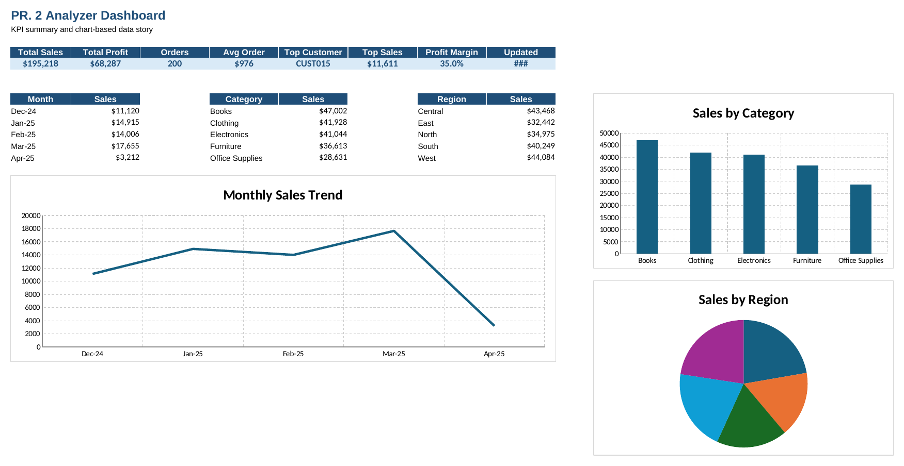
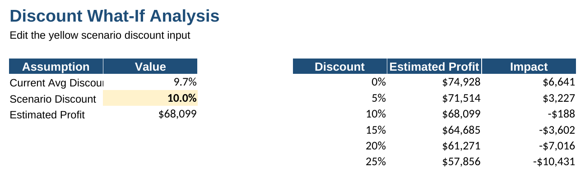
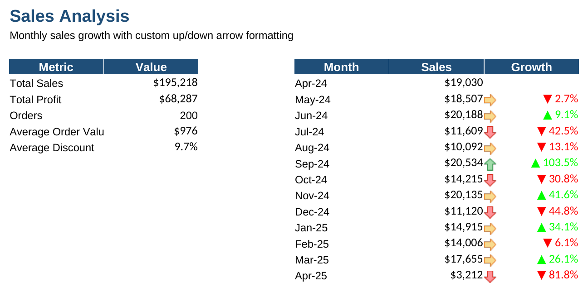
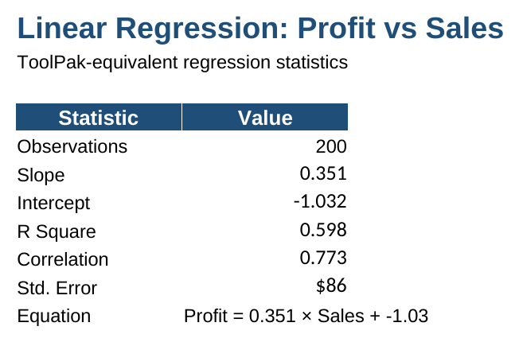
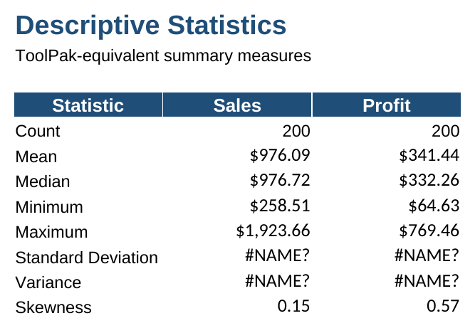
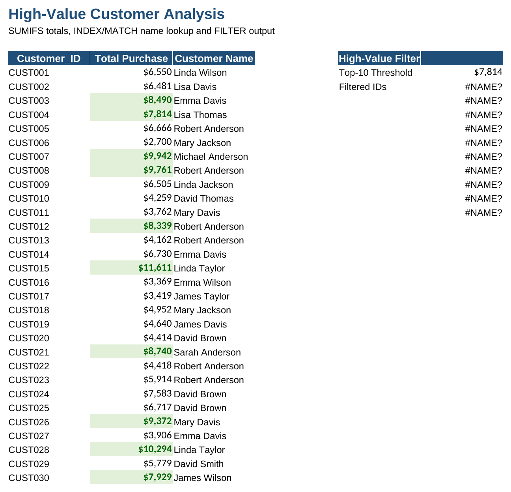
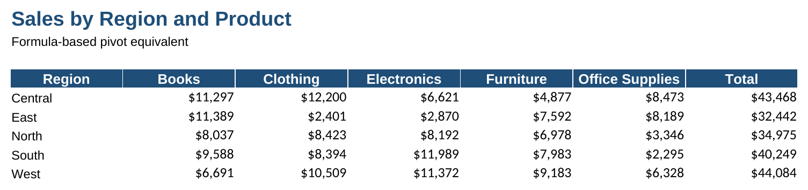
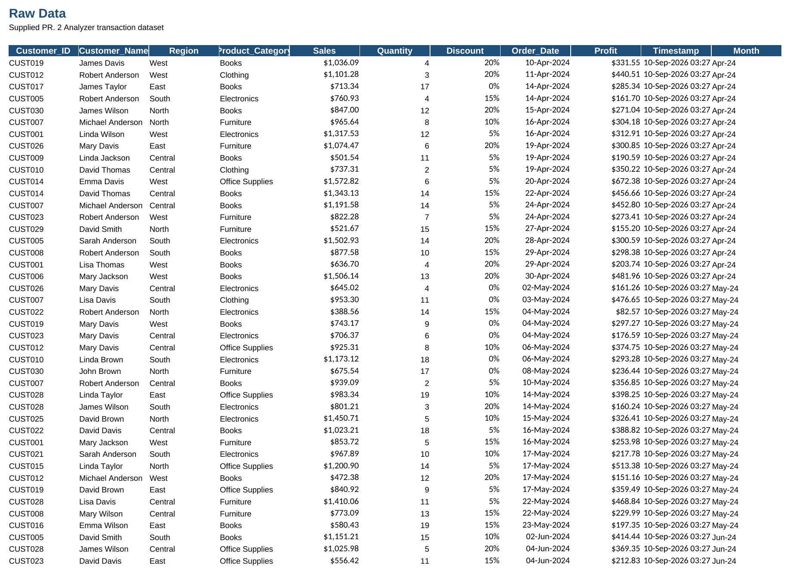

<div align="center">

# -- ! PR. 2 Analyzer ! --
### *Excel-Based Sales Dashboard & Data Analysis Workbook*

[](https://www.microsoft.com/microsoft-365/excel)
[](https://www.microsoft.com/microsoft-365/excel)
[](https://www.microsoft.com/microsoft-365/excel)
[](https://www.microsoft.com/microsoft-365/excel)

<br/>

> *"Raw data tells you what happened — a good dashboard tells you why it matters."*

</div>

---

## 📋 Table of Contents

- [📌 Overview](#-overview)
- [🎯 Problem Statement](#-problem-statement)
- [✨ Key Features](#-key-features)
- [🏗️ Project Structure](#️-project-structure)
- [🔄 Project Workflow](#-project-workflow)
- [📊 Sheet-by-Sheet Breakdown](#-sheet-by-sheet-breakdown)
- [🖼️ Screenshots](#️-screenshots)
- [🛠️ Tech Stack](#️-tech-stack)
- [📈 Results & Insights](#-results--insights)
- [🏆 Advantages](#-advantages)
- [📄 License](#-license)
- [👤 Author](#-author)
- [🙏 Acknowledgements](#-acknowledgements)

---

## 📌 Overview

The **PR. 2 Analyzer** is a self-contained Excel workbook that turns a raw transaction log into a full sales analytics package — a KPI dashboard, a discount what-if simulator, growth trend analysis, linear regression, descriptive statistics, a high-value customer lookup, and a formula-built pivot table. Every number on every sheet is a **live formula**, so the whole workbook recalculates the moment the raw data changes.

This project is designed to:
- Demonstrate real-world spreadsheet modeling using only native Excel formulas (no macros, no add-ins)
- Turn 200 rows of transactional data into decision-ready KPIs and visuals
- Practice `SUMIFS`, `INDEX`/`MATCH`, and array-style logic as a pivot-table substitute
- Simulate "what-if" business scenarios (e.g., discount changes) without touching the source data
- Apply basic statistics (mean, median, std. dev., skewness) and linear regression to a sales dataset

---

## 🎯 Problem Statement

> **Objective:** Build a single Excel workbook that ingests raw sales transactions and produces a complete analytical story — summary KPIs, trends, forecasting, and customer insights — using formulas only.

You are given a raw log of customer orders (ID, region, category, sales, discount, profit, date). The workbook must classify, aggregate, and visualize this data across multiple linked sheets so a non-technical reader can open one tab — the Dashboard — and understand the business at a glance, while an analyst can drill into any supporting sheet for the underlying math.

| 📂 Sheet | 📄 Type | 🔍 Description |
|----------|---------|-----------------|
| Dashboard | KPI + Charts | Headline metrics and three summary charts |
| What_If | Scenario Model | Discount-sensitivity simulator |
| Analysis | Trend Table | Month-over-month sales growth with arrows |
| Regression | Statistics | Linear regression of Profit vs. Sales |
| Descriptive_Stats | Statistics | Mean, median, std. dev., skewness, etc. |
| Customer_Analysis | Lookup | High-value customer ranking and filter |
| Pivot | Aggregation | Formula-based region × category pivot |
| Raw_Data | Source | The 200-row transaction dataset |

The goal is to demonstrate **applied spreadsheet analytics** — the kind of workbook a small business or a student project would actually ship.

---

## ✨ Key Features

| Feature | Description |
|--------|-------------|
| 📊 **Live KPI Strip** | Total Sales, Total Profit, Orders, Avg Order, Top Customer, Top Sale, Profit Margin, Last Updated |
| 📈 **Three Dashboard Charts** | Monthly Sales Trend (line), Sales by Category (bar), Sales by Region (pie) |
| 🎚️ **Discount What-If Simulator** | Drag a single yellow input cell to see profit impact across 6 discount scenarios |
| 📉 **Growth Analysis** | Month-over-month % growth with conditional up/down formatting |
| 📐 **Linear Regression** | Slope, intercept, R², and correlation for Profit vs. Sales, plus the derived equation |
| 🧮 **Descriptive Statistics** | Count, mean, median, min, max, std. dev., variance, and skewness for Sales & Profit |
| 🏅 **High-Value Customer Filter** | `SUMIFS` totals, `INDEX`/`MATCH` name lookup, and a top-10 threshold filter |
| 🗂️ **Formula-Built Pivot** | Region × Category sales grid built entirely from `SUMIFS`, no PivotTable object |
| ✅ **Zero Hardcoded Results** | Every KPI, chart, and stat recalculates automatically from Raw_Data |

---

## 🏗️ Project Structure

```
📦 pr2-analyzer/
│
├── 📊 PR2_Analyzer.xlsx      ← Main workbook (all 8 sheets)
│
└── 📄 README.md              ← Project documentation
```

---

## 🔄 Project Workflow

```
Raw_Data (200 transactions)
      │
      ▼
┌───────────────────────────────┐
│   Formula Layer (SUMIFS,      │
│   INDEX/MATCH, AVERAGE, etc.) │
└───────────────┬───────────────┘
                │
     ┌──────────┼───────────┬─────────────┬────────────────┐
     ▼          ▼           ▼             ▼                ▼
┌─────────┐ ┌────────┐ ┌──────────┐ ┌────────────┐ ┌──────────────────┐
│Dashboard│ │What_If │ │ Analysis │ │ Regression │ │ Customer_Analysis│
│ KPIs +  │ │Discount│ │ Growth   │ │ Profit vs  │ │  High-Value      │
│ Charts  │ │Scenario│ │ Trend    │ │ Sales      │ │  Lookup + Filter │
└─────────┘ └────────┘ └──────────┘ └────────────┘ └──────────────────┘
                │
                ▼
        ┌───────────────┐       ┌──────────────────┐
        │     Pivot     │       │ Descriptive_Stats │
        │ Region ×      │       │  Mean / Median /  │
        │ Category grid │       │  Std Dev / Skew   │
        └───────────────┘       └──────────────────┘
```

---

## 📊 Sheet-by-Sheet Breakdown

### 1️⃣ Dashboard

> The landing tab. One glance gives Total Sales, Total Profit, Orders, Average Order Value, Top Customer, Top Sale, and Profit Margin, backed by three charts (monthly trend, category bar, region pie).

**Sample KPI row:**

| Total Sales | Total Profit | Orders | Avg Order | Top Customer | Top Sales | Profit Margin |
|---|---|---|---|---|---|---|
| $195,218 | $68,287 | 200 | $976 | CUST015 | $11,611 | 35.0% |

---

### 2️⃣ What_If — Discount Sensitivity

> Change one yellow input cell (Scenario Discount) and watch Estimated Profit and Impact recalculate across a 0%–25% discount table.

| Discount | Estimated Profit | Impact |
|---|---|---|
| 0% | $74,928 | +$6,641 |
| 10% | $68,099 | −$188 |
| 25% | $57,856 | −$10,431 |

---

### 3️⃣ Analysis — Monthly Growth

> Tracks month-over-month % growth using `(This Month − Last Month) / Last Month`, so seasonal swings (like the Apr-25 dip) are immediately visible.

---

### 4️⃣ Regression — Profit vs. Sales

> A full linear regression computed with native Excel statistical functions (`SLOPE`, `INTERCEPT`, `RSQ`, `CORREL`, `STEYX`):

```
Profit = 0.351 × Sales − 1.03
R² = 0.598   |   Correlation = 0.773
```

---

### 5️⃣ Descriptive_Stats

> `COUNT`, `AVERAGE`, `MEDIAN`, `MIN`, `MAX`, `STDEV`, `VAR`, and `SKEW` computed independently for the Sales and Profit columns.

---

### 6️⃣ Customer_Analysis — High-Value Filter

> Combines `SUMIFS` (per-customer totals), `INDEX`/`MATCH` (name lookup by ID), and a top-10 threshold filter to surface the highest-spending customers without a PivotTable.

---

### 7️⃣ Pivot — Region × Category Grid

> A fully formula-driven pivot equivalent: five regions across five product categories, each cell a `SUMIFS`, with row totals on the right.

---

### 8️⃣ Raw_Data

> The single source of truth — 200 rows of Customer ID, Name, Region, Category, Sales, Quantity, Discount, Order Date, Profit, and Month. Every other sheet reads from here.

---

## 🖼️ Screenshots

### Dashboard




### What_If — Discount Sensitivity Table

!

### Analysis — Monthly Growth Table



### Regression — Profit vs Sales



### Descriptive_Stats Table



### Customer_Analysis — High-Value Customer Table



### Pivot Table — Sales by Region and Product



### Raw_Data Table



---

## 🛠️ Tech Stack

| Tool | Version | Purpose |
|------|---------|---------|
| 📊 **Microsoft Excel** | 2007+ | Core spreadsheet application |
| 🧮 **SUMIFS / SUMPRODUCT** | Built-in | Conditional aggregation, pivot substitute |
| 🔎 **INDEX / MATCH** | Built-in | Name lookups, threshold filtering |
| 📐 **SLOPE / INTERCEPT / RSQ / CORREL** | Built-in | Linear regression statistics |
| 📈 **STDEV / VAR / SKEW** | Built-in | Descriptive statistics |
| 📉 **Native Excel Charts** | Built-in | Line, bar, and pie charts on the dashboard |
| 🎨 **Conditional Formatting** | Built-in | Up/down growth arrows on the Analysis sheet |

---

## 📈 Results & Insights

After opening the workbook, the following outputs are produced:

- ✅ **One-glance KPI Dashboard** — Sales, Profit, Orders, Avg Order, Top Customer, and Margin, all live
- 💰 **$195,218 in Total Sales** across 200 orders, at a 35.0% blended profit margin
- 📉 **Discount sensitivity mapped** — every 5% increase in discount cuts profit by roughly $3,400–$3,600
- 📊 **Books leads all categories** at $47,002 in sales, followed by Clothing and Electronics
- 🌍 **West is the top-performing region** at $44,084 in sales, narrowly ahead of Central
- 📈 **Moderate positive correlation** (r = 0.77) between Sales and Profit, confirmed by regression
- 🏅 **CUST015 is the top customer** by total purchase value ($11,611)

---

## 🏆 Advantages

| Advantage | Detail |
|-----------|--------|
| 🎓 **No Macros Required** | Every feature runs on native Excel formulas — opens safely anywhere |
| 🔄 **Fully Live** | Edit Raw_Data and every KPI, chart, and stat updates automatically |
| 📚 **Educational** | Doubles as a formula reference for `SUMIFS`, `INDEX`/`MATCH`, and regression functions |
| 🖥️ **Single File** | One `.xlsx`, zero external dependencies |
| 🎚️ **Interactive** | The What-If sheet lets anyone test a scenario without editing source data |
| 🧪 **Extensible** | Easy to add new regions, categories, or KPIs by extending Raw_Data |
| 🛡️ **Formula-Verified** | No hardcoded results — the model recalculates from a single source of truth |

---

## 📄 License

This project is licensed under the **MIT License** — see the [LICENSE](LICENSE) file for full details.

```
MIT License — Free to use, modify, and distribute with attribution.
```

---

## 👤 Author

<div align="center">

### KRINAL DHOLAKIYA

[](https://github.com/)
[](https://www.linkedin.com/)

> *"Every dashboard starts with a single formula — just like every insight starts with raw data."*

**🎓 Role:** Data Analyst | Excel Enthusiast \
**📍 Location:** India \
**🛠️ Skills:** Excel · SUMIFS/INDEX-MATCH · Dashboards · Regression · Data Storytelling

</div>

---

## 🙏 Acknowledgements

Special thanks to the following resources that made this project possible:

- 📚 [Microsoft Excel Function Reference](https://support.microsoft.com/en-us/office/excel-functions-alphabetical-b3944572-255d-4efb-bb96-c6d90033e188) — Official formula documentation
- 🔎 [ExcelJet — INDEX/MATCH](https://exceljet.net/formulas/index-and-match) — Lookup formula patterns
- 🧮 [ExcelJet — SUMIFS](https://exceljet.net/functions/sumifs-function) — Conditional aggregation reference
- 📐 [Statistics How To — Linear Regression](https://www.statisticshowto.com/probability-and-statistics/regression-analysis/) — Regression concepts
- 💬 [Stack Overflow Community](https://stackoverflow.com/) — Formula troubleshooting support

---

<div align="center">

---

*Made with 📊 and ☕ — Last updated: 10 September, 2026*

</div>
