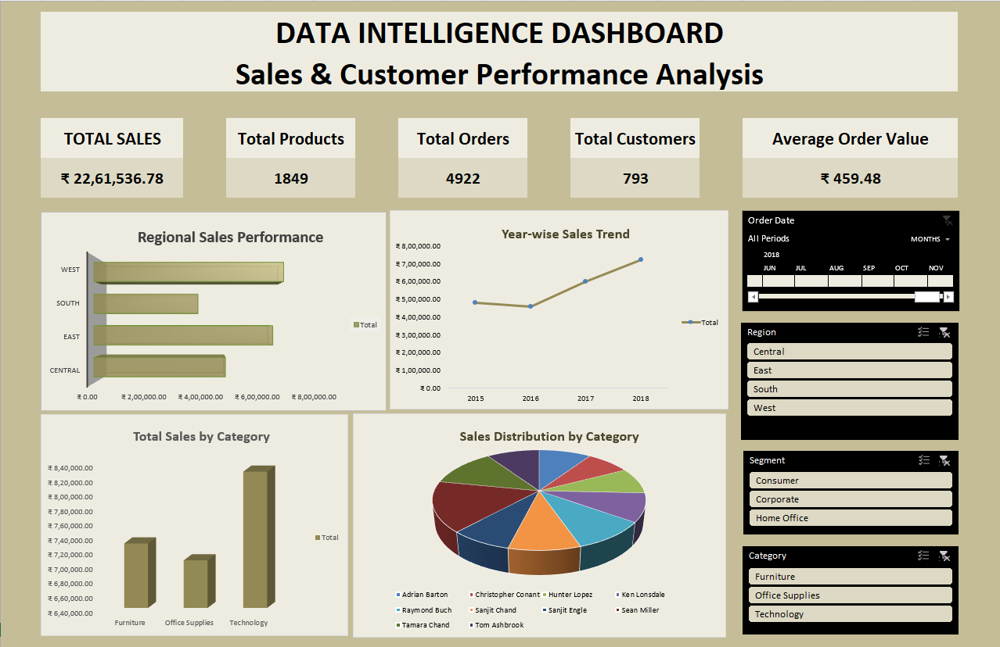
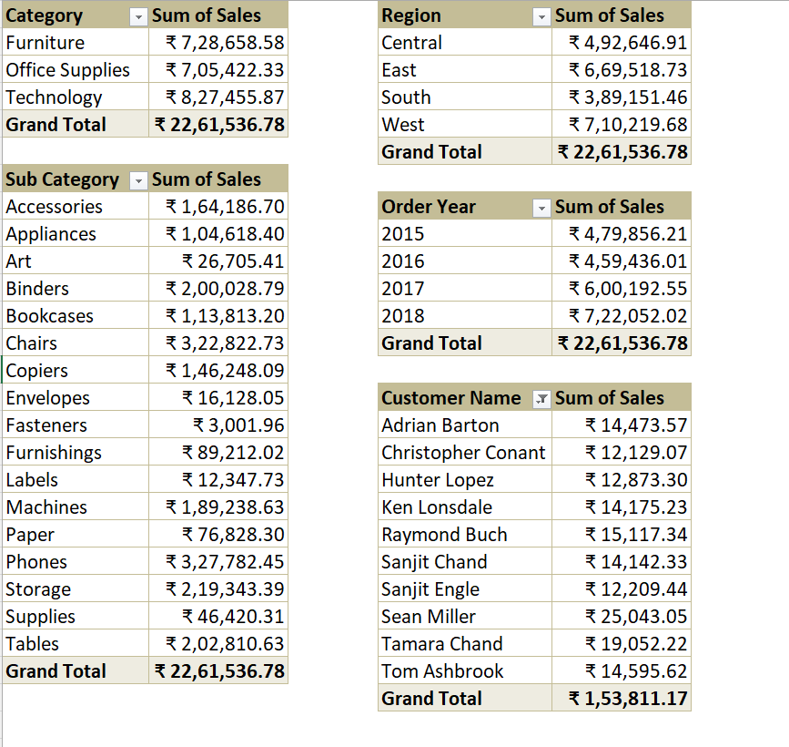
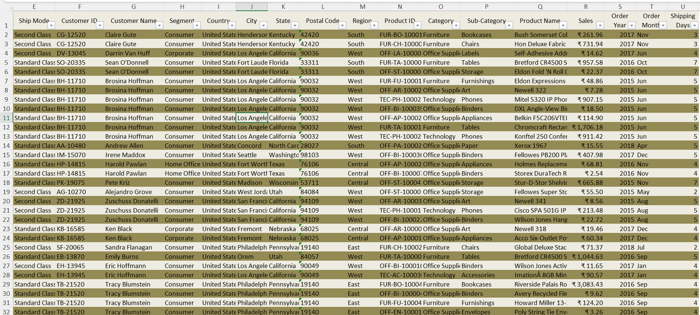
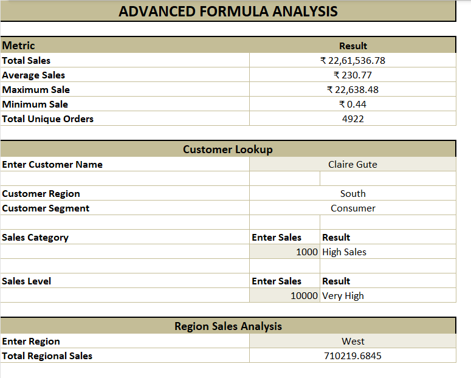
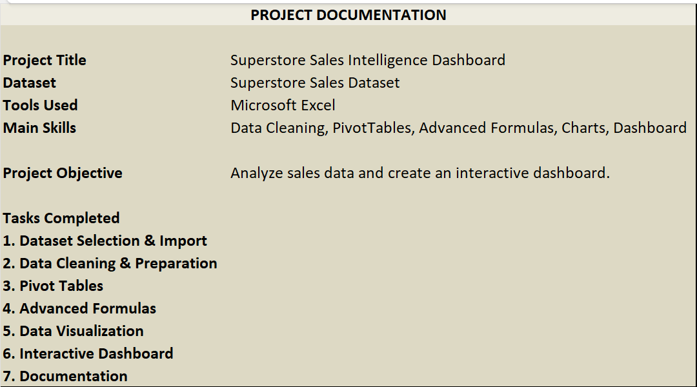

<div align="center">

# -- ! Superstore Sales Intelligence Dashboard ! --
### *Interactive Excel Dashboard for Sales & Customer Performance Analysis*

[](https://www.microsoft.com/excel)
[](https://www.microsoft.com/excel)
[](https://www.microsoft.com/excel)
[](https://www.microsoft.com/excel)

<br/>

> *"Data is only noise until you give it a dashboard to speak through."*

</div>

---

## 📋 Table of Contents

- [📌 Overview](#-overview)
- [🎯 Problem Statement](#-problem-statement)
- [✨ Key Features](#-key-features)
- [🏗️ Project Structure](#️-project-structure)
- [🔄 Project Workflow](#-project-workflow)
- [📊 Part A — Interactive Dashboard](#-part-a--interactive-dashboard)
- [📑 Part B — PivotTable Summaries](#-part-b--pivottable-summaries)
- [🗃️ Part C — Cleaned Raw Data](#️-part-c--cleaned-raw-data)
- [🧮 Part D — Advanced Formula Analysis](#-part-d--advanced-formula-analysis)
- [📄 Part E — Project Documentation Sheet](#-part-e--project-documentation-sheet)
- [🛠️ Tech Stack](#️-tech-stack)
- [📈 Results & Insights](#-results--insights)
- [🏆 Advantages](#-advantages)
- [📄 License](#-license)
- [👤 Author](#-author)
- [🙏 Acknowledgements](#-acknowledgements)

---

## 📌 Overview

The **Superstore Sales Intelligence Dashboard** is an end-to-end Excel analytics project built on the classic **Superstore Sales Dataset**. It demonstrates core data-analysis skills such as **data cleaning**, **PivotTables**, **advanced formulas (VLOOKUP, IF, SUMIFS, nested logic)**, **charting**, and a fully **interactive dashboard** with slicers for Region, Segment, and Category.

This project is designed to:
- Strengthen understanding of PivotTables and PivotCharts
- Practice data cleaning and preparation on a real-world sales dataset
- Apply advanced Excel formulas to answer business questions
- Produce a visually structured, decision-ready dashboard

---

## 🎯 Problem Statement

> **Objective:** Build an interactive Excel dashboard to analyze sales and customer performance across regions, categories, and time.

You are working as a data analyst tasked with turning a raw Superstore transactions file into actionable insights. The workbook must clean the raw data, summarize it using PivotTables, apply advanced formulas for lookups and classifications, and present everything in a single interactive dashboard.

| 📂 Feature | 📄 Type | 🔍 Description |
|------------|---------|----------------|
| Dashboard | Visual Output | Single-page KPI + chart view with slicers |
| Regional Sales Performance | Chart | Bar chart comparing sales across regions |
| Year-wise Sales Trend | Chart | Line chart tracking sales growth 2015–2018 |
| Category/Sub-Category Breakdown | PivotTable | Sales summarized by product hierarchy |
| Advanced Formula Panel | Logic | Lookup, classification & aggregation formulas |

The goal is to demonstrate **end-to-end Excel data-analysis skills** through a clean, interactive, single-workbook dashboard.

---

## ✨ Key Features

| Feature | Description |
|--------|-------------|
| 📊 **KPI Summary Cards** | Total Sales, Total Products, Total Orders, Total Customers, Avg Order Value |
| 🗺️ **Regional Sales Chart** | Horizontal bar chart comparing Central, East, South, West |
| 📈 **Year-wise Sales Trend** | Line chart showing sales growth from 2015 to 2018 |
| 🥧 **Category Distribution** | Pie chart of sales share by customer/category |
| 🎚️ **Interactive Slicers** | Filter by Order Date, Region, Segment, and Category |
| 📑 **6 PivotTables** | Category, Sub-Category, Region, Order Year, Customer Name summaries |
| 🧮 **Advanced Formulas** | Customer lookup, sales-level classification, regional totals |
| 🧹 **Cleaned Dataset** | Structured raw data with Ship Mode, Region, Product & Sales fields |

---

## 🏗️ Project Structure

```
📦 superstore-sales-dashboard/
│
├── 📄 Superstore_Sales_Project_practical.xlsx   ← Main Excel workbook
│   ├── 🧾 Sheet: Dashboard
│   ├── 🧾 Sheet: PivotTables
│   ├── 🧾 Sheet: Raw Data
│   ├── 🧾 Sheet: Advanced Formulas
│   └── 🧾 Sheet: Documentation
│
└── 📄 README.md                                  ← Project documentation
```

---

## 🔄 Project Workflow

```
Project Start
      │
      ▼
┌─────────────────────────────┐
│   Import Raw Superstore     │  ← Ship Mode, Customer, Product, Sales, Dates
│   Sales Dataset             │
└────────────┬────────────────┘
             │
             ▼
┌─────────────────────────────┐
│   Data Cleaning & Prep      │  ← Fix headers, split date fields, remove errors
└────────────┬────────────────┘
             │
             ▼
┌─────────────────────────────┐
│   Build PivotTables         │  ← Category, Sub-Category, Region, Year, Customer
└────────────┬────────────────┘
             │
             ▼
┌─────────────────────────────┐
│   Apply Advanced Formulas   │  ← VLOOKUP, IF, SUMIFS, nested classification
└────────────┬────────────────┘
             │
             ▼
┌─────────────────────────────┐
│   Design Charts             │  ← Bar, Line, Pie / Column charts
└────────────┬────────────────┘
             │
             ▼
┌─────────────────────────────┐
│   Assemble Interactive      │  ← KPI cards + charts + slicers on one page
│   Dashboard                 │
└────────────┬────────────────┘
             │
             ▼
     Document & Deliver ✅
```

---

## 📊 Part A — Interactive Dashboard

> The main dashboard combines KPI cards, four charts, and three slicers (Order Date, Region, Segment, Category) into a single filterable view.

**Highlights:**
- **Total Sales:** ₹22,61,536.78 across **4,922 orders** and **793 customers**
- **Average Order Value:** ₹459.48
- Regional performance chart shows **West** leading sales, followed by East, Central and South
- Year-wise trend shows consistent growth from 2015 to 2018, peaking in 2018
- Category-wise column chart shows **Technology** as the top-selling category



---

## 📑 Part B — PivotTable Summaries

> Six PivotTables break down total sales by Category, Sub-Category, Region, Order Year, and Customer Name.

**Logic Used:**
```
Category        → Grand Total: ₹22,61,536.78
Region          → West leads at ₹7,10,219.68
Order Year      → 2018 highest at ₹7,22,052.02
Sub-Category    → Phones & Chairs are top sub-categories
Customer Name   → Sean Miller is the top individual customer (₹25,043.05)
```



---

## 🗃️ Part C — Cleaned Raw Data

> The underlying transactional data was cleaned and structured with consistent columns: Ship Mode, Customer, Segment, Location, Product hierarchy, Sales, Order Year/Month, and Shipping Days.

**Key Concepts Used:**

| Concept | Detail |
|---------|--------|
| 🧹 Header Standardization | Clear, filterable column headers |
| 📅 Derived Date Fields | Order Year, Order Month, Shipping Days calculated |
| 🏷️ Product Hierarchy | Category → Sub-Category → Product Name |
| 🔍 AutoFilter | Every column filterable for quick drill-down |



---

## 🧮 Part D — Advanced Formula Analysis

> A dedicated formula panel uses lookup and classification logic to answer ad-hoc business questions.

**Logic:**
```excel
=VLOOKUP(CustomerName, RawData, RegionColumn, FALSE)      ' Customer Region Lookup
=IF(Sales>=5000,"High Sales","Low Sales")                 ' Sales Category Classification
=IF(Sales>=10000,"Very High",IF(Sales>=5000,"High","Low")) ' Sales Level Tiering
=SUMIFS(Sales, Region, "West")                            ' Region Sales Analysis
```

**Sample Output:**
```
Total Sales        : ₹22,61,536.78
Average Sales       : ₹230.77
Maximum Sale         : ₹22,638.48
Minimum Sale          : ₹0.44
Total Unique Orders    : 4,922
Customer "Claire Gute" : South / Consumer
Sales 1000 → High Sales
Sales 10000 → Very High
West Region Total : ₹7,10,219.68
```



---

## 📄 Part E — Project Documentation Sheet

> A documentation sheet inside the workbook records the project title, dataset, tools, skills, objective, and completed tasks — making the file self-explanatory for anyone who opens it.



---

## 🛠️ Tech Stack

| Tool | Feature | Purpose |
|------|---------|---------|
| 🟢 **Microsoft Excel** | Core Tool | Data cleaning, analysis & dashboarding |
| 📑 **PivotTables** | Built-in | Category, Region, Year & Customer summaries |
| 🎚️ **Slicers** | Built-in | Interactive filtering by Date, Region, Segment, Category |
| 📊 **Charts** | Bar / Line / Pie / Column | Visual storytelling of sales trends |
| 🧮 **Formulas** | VLOOKUP, IF, SUMIFS, Nested IF | Lookups, classification & conditional totals |
| 🖨️ **Conditional Formatting** | Built-in | Highlighting KPI thresholds |

---

## 📈 Results & Insights

After building the workbook, the following outputs are produced:

- ✅ **Single-Page Interactive Dashboard** — KPIs, 4 charts, 3 slicers
- 🔢 **6 PivotTables** — Category, Sub-Category, Region, Year, Customer breakdowns
- ➕ **Advanced Formula Panel** — Lookup, classification & regional totals
- 🗺️ **West Region** identified as the top-performing region (₹7,10,219.68)
- 📈 **Consistent YoY Growth** — Sales rose from ₹4,79,856.21 (2015) to ₹7,22,052.02 (2018)
- 🏆 **Technology** is the highest-selling category (₹8,27,455.87)

---

## 🏆 Advantages

| Advantage | Detail |
|-----------|--------|
| 🎓 **Beginner–Intermediate Friendly** | Combines PivotTables, formulas & charts in one file |
| 🔄 **Reusability** | Structure can be reused for any transactional sales dataset |
| 📚 **Educational** | Each sheet reinforces a distinct Excel analytics skill |
| 🖥️ **No Add-ins Needed** | Runs with native Excel features only |
| ⚡ **Lightweight** | Single-workbook deliverable, easy to share |
| 🧪 **Extensible** | Easy to add new KPIs, charts, or Power Query steps |
| 📖 **Well Documented** | Built-in documentation sheet explains the whole project |
| 🛡️ **Data Integrity** | Cleaned data with consistent formats and filters |

---

## 📄 License

This project is licensed under the **MIT License** — see the [LICENSE](LICENSE) file for full details.

```
MIT License — Free to use, modify, and distribute with attribution.
```

---

## 👤 Author

<div align="center">

### Your Name

[](https://github.com/yourhandle)
[](https://www.linkedin.com/in/yourhandle/)

> *"Every dashboard starts with a single clean row — just like every insight starts with a single question."*

**🎓 Role:** Data Analyst | Excel Enthusiast \
**📍 Location:** India \
**🛠️ Skills:** Excel · PivotTables · Advanced Formulas · Data Visualization · Dashboarding

</div>

---

## 🙏 Acknowledgements

Special thanks to the following resources and communities that made this project possible:

- 📊 [Microsoft Excel Support](https://support.microsoft.com/excel) — Official Excel documentation
- 📑 [Excel Jet — PivotTables](https://exceljet.net/pivot-tables) — PivotTable tutorials
- 🧮 [Excel Jet — Formulas](https://exceljet.net/formulas) — Formula references
- 🗂️ [Kaggle — Superstore Dataset](https://www.kaggle.com/datasets) — Source dataset
- 💬 [Stack Overflow Community](https://stackoverflow.com/) — Problem-solving support
- 📖 [Chandoo.org](https://chandoo.org/) — Dashboarding tips & tricks

---

<div align="center">

---

*Made with 📊 and ☕ — Last updated: 18 September, 2026*

</div>
